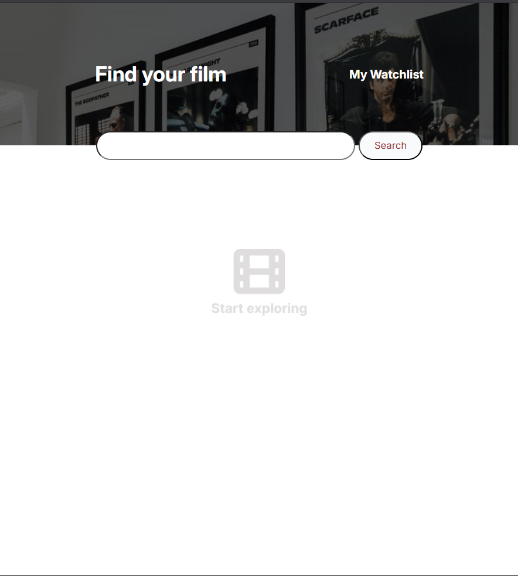
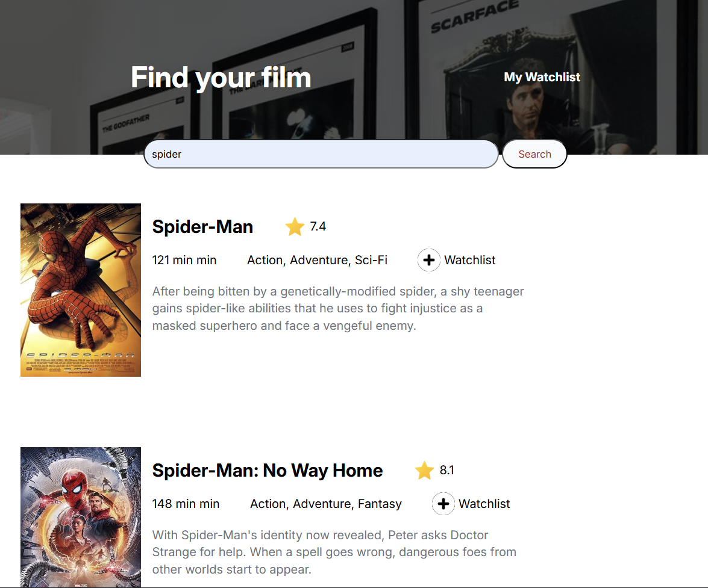
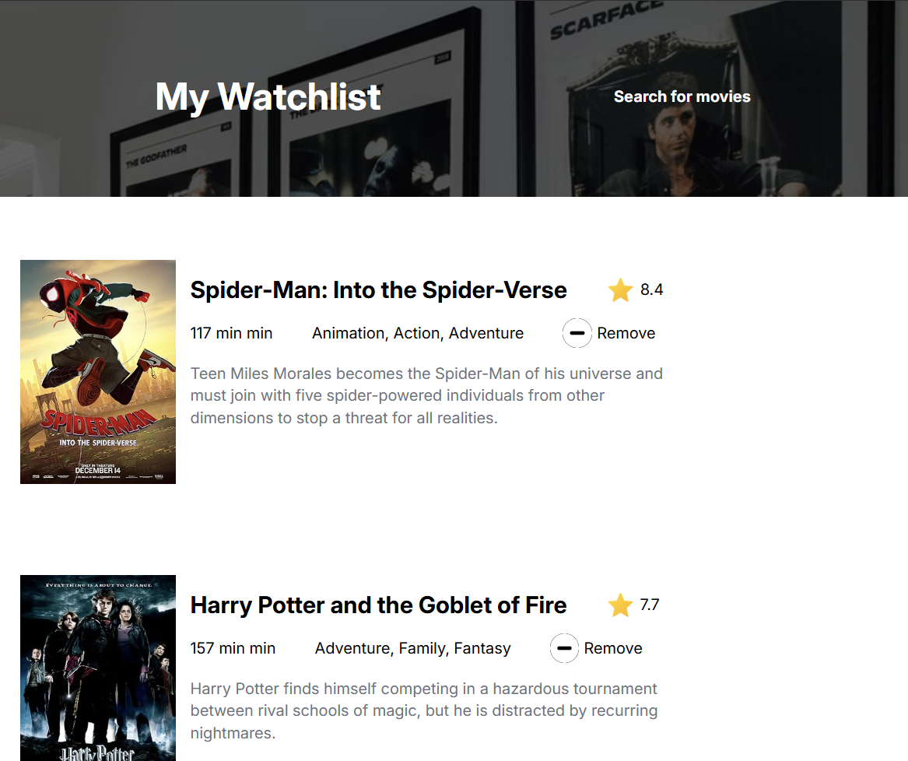

# Movie_Search & Watchlist DB

### Description
This is a wonderful movie searching site with the implementation of add to the wish list and remove from wish wishlist

## ScreenShots
|Initial Homepage|Search Result|Wishlist Page|
|----------------|----------------|----------------|
||||

## Features
This app includes:
- **Movie Search**: User can dinamically search movie by their name
- **Add to WishList**: User can add their favorite movie to the wishList
- **Remove from WishList**: User can also remove movie from their wish list

## Technology Stack Used

## Skill Acquired
During doing doing this project following skill has been learned and studied:

- Using double async await function and fetch the data.
- create single element and append this to html
- handle wrong search as catch error and display the message
- Using localstorage to set data,get data and render data
- Implementing event delegation on click.
